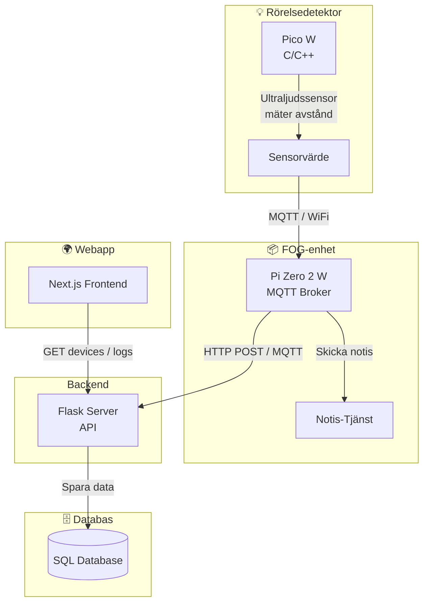

# Jensen Hemlarm 2.0 (C/C++)

Detta projekt visar hur du ställer in Raspberry Pi Pico W för att ansluta till ett WiFi-nätverk och skicka mätvärden via mqtt till en broker (raspberry Zero) med C++.

## Beroenden

* Raspberry Pi Pico SDK
* CMake
* Make
## Arkitekturschema



## Installation

1.  **Klona repot:**

```bash
    git clone https://github.com/Brumse/Jensen-hemlarm-2.0.git
```

2.  **Skapa headerfil med WiFi-uppgifter:**
```bash
    cat > picoCode/include/wifi_credentials.h << EOF
    #pragma once
    #include <string>

    const std::string WIFI_SSID = "change to your SSID";
    const std::string WIFI_PASSWORD = "change to your WiFi password";
    EOF
```
**Lägg till mqtt config med IP för raspberry zero**
```bash
    cat > picoCode/include/mqtt_config.h << EOF
#pragma once


#define _MQTT_BROKER_IP "change Rapberry Zero IP-adress"
#define _MQTT_PORT 1883
#define MQTT_TOPIC_LEN 100
#define MQTT_SUBSCRIBE_QOS 1
#define MQTT_PUBLISH_QOS 2 //changed to QOS 2 to make sure we get all messages
#define MQTT_PUBLISH_RETAIN 0

/*
#define MQTT_WILL_TOPIC "/online"
#define MQTT_WILL_MSG "0"
#define MQTT_WILL_QOS 1
*/
#ifndef MQTT_DEVICE_NAME
#define MQTT_DEVICE_NAME "pico" // change name on your device if you want..
#endif
EOF
```
Om pin 2,3,15 är upptagen så korrigera även headern sensor_config.h till PINS du vill använda, threshold går även att korrigeras där.
```bash
const uint TRIG_PIN = 2; 
const uint ECHO_PIN = 3;
const uint LED_PIN = 15;

// set threshold for alarm
const float ALARM_THRESHOLD = 10.0f;
````


**Viktigt:** Byt ut `"change to your SSID"` och `"change to your WiFi password"` med dina faktiska WiFi-uppgifter. 
    
**Var försiktig med att inte lägga upp denna fil på ett publikt git repo!**.

3.  **Konfigurera CMake:**
```bash
    cmake -B build
```

4.  **Bygg projektet med Make:**

```bash
    make -C build
```
Den kompilerade `.uf2`-filen skapas i `build/bin`.

5. Koppla enligt schema 


7.  **Bootload Pico W:**

    Sätt din Pico W i bootload-läge genom att hålla ner BOOTSEL-knappen och ansluta den till din dator. Kopiera eller flytta `.uf2`-filen till Pico W.

om du inte har satt upp Rasp Zero så kan ni kolla på detta repo
```bash
    https://github.com/Brumse/RaspberryZero
```

7. **SSH:a in i din rasp zero och installera mosquitto och mosquitto client**
    
```bash 
    sudo apt install mosquitto mosquitto-clients -y
``` 
```bash
    sudo apt install libmosquitto-dev
    sudo apt install libjansson-dev libcurl4-openssl-dev
```
8. Lägg in information i mosquitto conf för att kunna lyssna och välj rätt port.
```bash
    sudo vim /etc/mosquitto/mosquitto.conf
```
lägg in detta längst ner i filen:
```bash 
    allow_anonymous true
    listener 1883 0.0.0.0
```

9. klona repon i din Raspberry Zero bygg zeroCode och kör den.
```bash
    git clone https://github.com/Brumse/Jensen-hemlarm-2.0.git
    cd zeroCode/
```
kör programmet på zeron.
```bash
    ./build/bin/mqtt_to_api
```

## Notera att mqtt_to_api på rasp zero  måste köra innan koden pico W för att det krävs att någon lyssnar via mqtt för att den ska köra.
## Felhantering

* Om anslutningen misslyckas, kontrollera att ditt SSID och lösenord är korrekta.
* Om Pico W inte hittas på nätverket, kontrollera att den är korrekt bootloadad och att ditt WiFi-nätverk fungerar.
